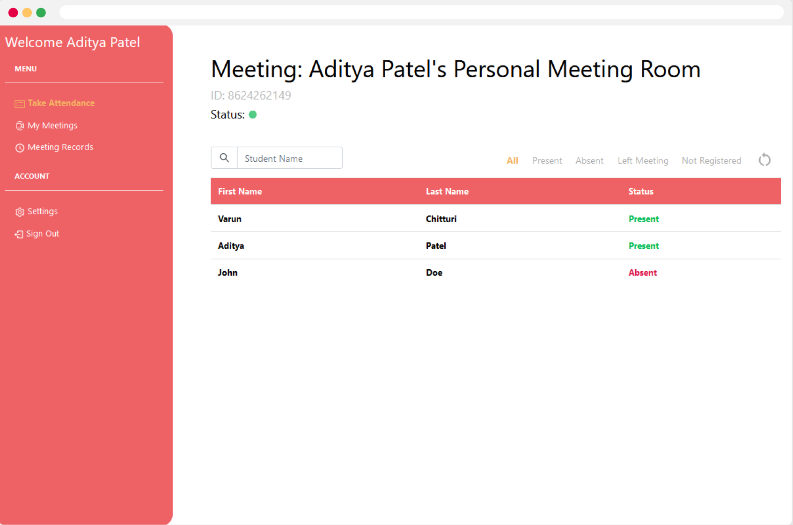
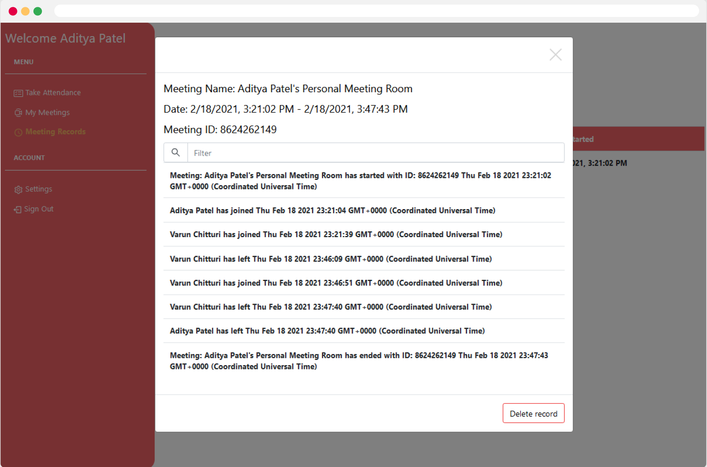
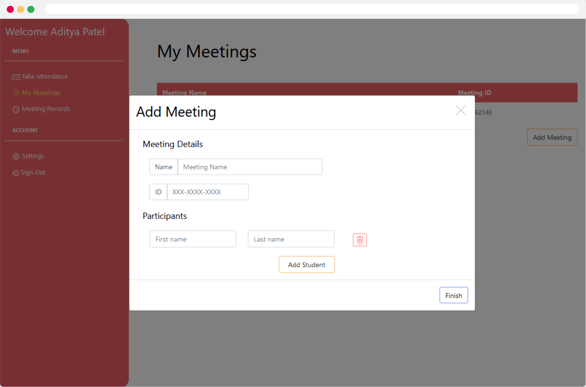

    
     
    
     

#### Developers: Varun Chitturi and Aditya Patel

#### Public Relations: Sunny Chadha

#### Legal: Devan Velji

#### Finance: Devan Velji and Sunny Chadha

An integration with Zoom to allow teachers to be able to take attendance faster and easier. This Zoom Marketplace app connects to Zoom and allows teachers to easily and automatically track the attendance of their students. Later, detailed records are produced and stored for reference. This app connects to easeattendance.com to take attendance.

Go to [Ease Attendance](https://www.easeattendance.com/) to find more info about features, documentation, support from developers, more about us and our goals, and to ***start easily taking attendance***!

## Features

1. Easily and efficiently see all who are present, absent or have left the meeting. Live.

2. Sort the meeting to only see those who are present, absent or have left the meeting.

3. View Meeting Records in a simple format, with a search feature to find info about a particular participant or about a particular time.

## Setup

1. Install the plugin [here](https://zoom.us/oauth/authorize?response_type=code&client_id=jr7r46eTRvyF0CPmGFBGGA&redirect_uri=https://www.easeattendance.com/authorize)
2. Create an account with the same email 
3. Create a Meeting with a class roster Automatically or Manually:

### Automatic Class Roster Creation or Addition

1. Log into a account and start a Zoom meeting
2. If you see a "Not Registered" next to someone's name, either 
* click the "Update Participants" button to create a meeting with current participants during the meeting. Ease Attendance will automatically fill out the Meeting ID, Meeting Name, and Participant names from your current meeting.

OR

* wait to the end of the meeting and Ease Attendance will show a popup to create a meeting with the Meeting ID, Meeting Name, and Participants from your just-ended Meeting.

3. Verify the details of the meetings by adjusting the Meeting ID and Meeting Name
4. Click "Finish"
5. Verify that your meeting is created in the "My Meetings" tab accessible from the right.

### Manual Meeting Creation

1. Open the "My Meetings" Tab and click "Add Meeting"
2. Fill out the Meeting Name, ID, and names of participants
3. Click "Finish"

Copyright (c) 2021 Ease Attendance - Varun Chitturi
